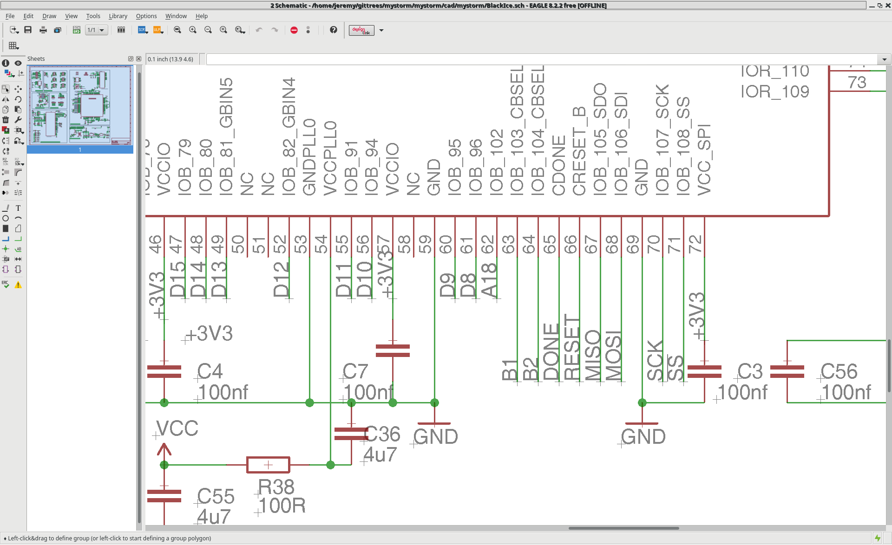

.. What's New in High-Performance Python? slides file, created by
   hieroglyph-quickstart on Sat Apr 30 21:13:03 2016.

Basic Verilog
=============

| Jeremy Bennett

The Process
-----------

.. figure:: process.png

Combinatorial Logic
-------------------

.. figure:: combinatorial.png

Sequential Logic
----------------

.. figure:: sequential.png

Register Transfer Logic
-----------------------

Designing individual gates and flip-flops is possible, but infeasible on huge
modern chips. Instead:

* we group flip flops together into **registers** to hold the state of one or
  more bits.

* we connect registers by networks of wires, or **nets**.

We will use **Verilog** to describe this. It provides

* **modules** to structure our design

* **sequential logic** to control how state moves between registers on clock
  edges

* **combinatorial logic** to link together nets continuously.

The LED Example: led.v
----------------------

This continuously assigns the value 1 to the LED pin:

.. code-block:: verilog

   module led (output led);

      assign led = 1;

   endmodule

But how does this understand that ``led`` is connected to the LED?

Interface to the LED Example: chip.v (1)
----------------------------------------

The module declaration tells us about all our input and output signals:

.. code-block:: verilog

   module chip (
       // 100MHz clock input
       input  clk,
       // SRAM Memory lines
       output [18:0] ADR,
       output [15:0] DAT,
       output RAMOE,
       output RAMWE,
       output RAMCS,
       // All PMOD outputs
       output [55:0] PMOD,
       input [1:0] BUT
     );

Interface to the LED Example: chip.v (2)
----------------------------------------

We can use continuous assignment to set signals we don't want to use:

.. code-block:: verilog

     // SRAM signals are not use in this design, lets set them to default values
     assign ADR[18:0] = {19{1'b0}};
     assign DAT[15:0] = {16{1'b0}};
     assign RAMOE = 1'b1;
     assign RAMWE = 1'b1;
     assign RAMCS = 1'b1;

     // Set unused pmod pins to default
     assign UART_TX = PMOD[11];
     assign PMOD[54:12] = {42{1'b0}};
     assign PMOD[10:00] = {11{1'b0}};

Interface to the LED Example: chip.v (3)
----------------------------------------

And finally we **instantiate** an instance of the ``led`` module inside the
``chip`` module.

.. code-block:: verilog

     led my_led (
       .led (PMOD[55])
     );

   endmodule

``PMOD[55]`` is the external pin corresponding to the red LED.  But how does
Verilog know that?

The Physical Constraints File (1)
---------------------------------

The file ``blackice.pcf`` maps the named top level ports to actual pin
numbers on the FPGA:

.. code-block:: text

   #pmod 1
   set_io PMOD[0] 94 # rd6
   set_io PMOD[1] 91 # rd4
   set_io PMOD[2] 88 # rd2
   set_io PMOD[3] 85 # rd0
   ...
   #pmod 14 SPI muxed with leds
   set_io PMOD[52] 71 #LD4,!SS,p14_1
   set_io PMOD[53] 67 #LD3,MISO,p14_2
   set_io PMOD[54] 68 #LD2,MOSI,p14_3
   set_io PMOD[55] 70 #LD1,SCL,p14_4

The Physical Constraints File (2)
---------------------------------

.. code-block:: text

   # SRAM
   set_io ADR[0] 137
   set_io ADR[1] 138
   set_io ADR[2] 139
   ...
   # Onboard 12Mhz oscillator
   set_io clk 129

   # Buttons
   set_io BUT[0] 63
   set_io BUT[1] 64

But where do you find the pin numbers?

MyStorm Schematic
-----------------

MyStorm repository, ``BlackIce`` branch, in the ``cad/mystorm`` directory.

.. figure:: mystorm-cad.png

MyStorm Schematic Detail
------------------------

First exercise
--------------

Start with ``led.v`` in the ``basic_verilog/led`` directory.  Complete it and
build it with::

  make led

Then try the following changes:

* Modify ``led.v`` and ``chip.v`` to light one of the other LEDs.

* Try lighting up more than one LED at once.

Next stage of the tutorial, we'll get the LED to change depending on which
button is pressed.

